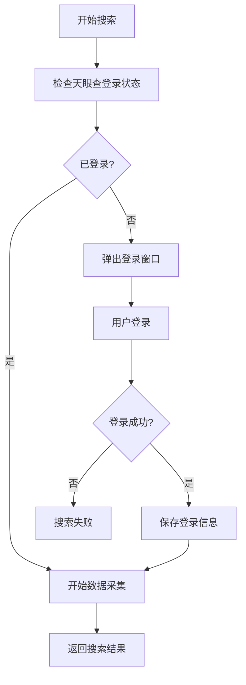

# 天眼查登录集成功能

## 概述

本功能在阿里巴巴供应商搜索之前自动检查天眼查登录状态，如果用户未登录，会弹出新窗口引导用户登录，确保数据采集的完整性和可靠性。

## 主要特性

### 🔐 自动登录检查
- 在每次搜索前自动检查天眼查登录状态
- 如果未登录，自动弹出登录窗口
- 支持登录信息缓存（24小时有效期）

### 🖥️ 用户友好的登录界面
- 弹出独立的浏览器窗口用于登录
- 智能检测登录状态变化
- 自动提取和保存登录信息

### 📊 登录状态管理
- 实时检查登录状态
- 手动清除登录信息
- 获取详细的登录信息

## 使用方法

### 基础用法

```typescript
import { AlibabaService } from './services/alibaba.service'

const alibabaService = new AlibabaService()

// 搜索供应商（会自动处理天眼查登录）
for await (const suppliers of alibabaService.searchSuppliersStream('laptop', undefined, 5)) {
  console.log(`获得 ${suppliers.length} 个供应商`)
  // 处理供应商数据...
}
```

### 手动管理登录状态

```typescript
// 1. 检查当前登录状态
const isLoggedIn = await alibabaService.getTianyanchaLoginStatus()
console.log(`登录状态: ${isLoggedIn}`)

// 2. 手动触发登录
if (!isLoggedIn) {
  const loginSuccess = await alibabaService.loginTianyancha()
  if (loginSuccess) {
    console.log('登录成功')
  }
}

// 3. 获取登录信息
const loginInfo = alibabaService.getTianyanchaLoginInfo()
if (loginInfo) {
  console.log('用户名:', loginInfo.userName)
  console.log('登录时间:', new Date(loginInfo.loginTime))
}

// 4. 清除登录信息（强制重新登录）
alibabaService.clearTianyanchaLogin()
```

### 带进度回调的搜索

```typescript
for await (const result of alibabaService.searchSuppliersWithProgress('smartphone', {
  onPageStart: (pageNumber) => {
    console.log(`开始采集第 ${pageNumber} 页`)
  },
  onPageComplete: (suppliers, pageNumber, totalFound) => {
    console.log(`第 ${pageNumber} 页完成，找到 ${suppliers.length} 个供应商`)
  },
  onError: (error, pageNumber) => {
    console.error(`第 ${pageNumber} 页失败: ${error.message}`)
  },
  maxPages: 10
})) {
  const { suppliers, pageNumber, totalFound } = result
  // 处理每页数据...
}
```

## API 参考

### TianyanchaService

#### 方法

- `checkLoginStatus(): Promise<boolean>` - 检查登录状态
- `showLoginWindow(): Promise<boolean>` - 显示登录窗口
- `ensureLoggedIn(): Promise<boolean>` - 确保已登录（自动处理）
- `getLoginInfo(): TianyanchaLoginInfo | null` - 获取登录信息
- `clearLoginInfo(): void` - 清除登录信息

#### 接口

```typescript
interface TianyanchaLoginInfo {
  isLoggedIn: boolean
  cookies: string
  userAgent: string
  loginTime: number
  userId?: string
  userName?: string
}
```

### AlibabaService 新增方法

- `getTianyanchaLoginStatus(): Promise<boolean>` - 获取天眼查登录状态
- `loginTianyancha(): Promise<boolean>` - 手动触发天眼查登录
- `clearTianyanchaLogin(): void` - 清除天眼查登录信息
- `getTianyanchaLoginInfo(): TianyanchaLoginInfo | null` - 获取天眼查登录信息

## 工作流程



## 配置选项

### 登录检测超时
- 默认：30秒
- 可在 `TianyanchaService` 构造函数中配置

### 登录信息有效期
- 默认：24小时
- 超过有效期会自动重新检查登录状态

### 用户登录等待时间
- 默认：5分钟
- 超时后会自动关闭登录窗口

## 注意事项

1. **首次使用**：首次运行时会弹出天眼查登录窗口，请确保网络连接正常
2. **登录保持**：登录信息会在内存中缓存，重启应用后需要重新登录
3. **多窗口**：登录窗口是独立的浏览器窗口，不会影响主要的采集任务
4. **错误处理**：如果登录失败，搜索任务会自动停止并返回错误信息

## 故障排除

### 登录窗口无法打开
- 检查防火墙设置
- 确保有足够的系统资源
- 检查网络连接

### 登录状态检测失败
- 清除登录信息后重试
- 检查天眼查网站是否正常访问
- 查看日志文件了解详细错误信息

### 搜索时提示未登录
- 手动调用 `loginTianyancha()` 方法
- 检查登录信息是否过期
- 清除缓存后重新登录

## 日志和调试

所有登录相关的操作都会记录详细日志，包括：
- 登录状态检查
- 用户登录过程
- 错误信息和异常处理
- 登录信息的保存和清除

查看日志文件可以帮助诊断问题。
