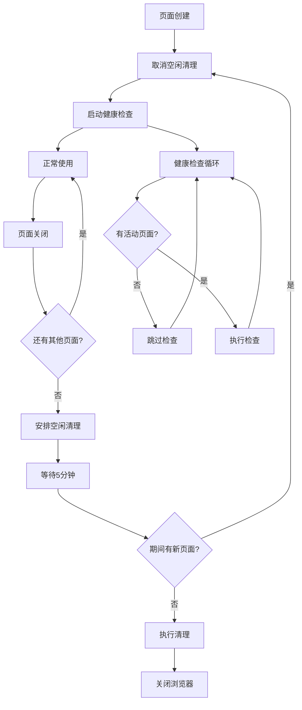

# 浏览器服务空闲管理优化

## 问题描述

在数据采集完成后，内部的 Chromium 浏览器会每隔一段时间出现，然后立马结束。这是由于健康检查机制在没有活动页面时仍然尝试重新初始化浏览器导致的。

## 解决方案

### 🎯 核心优化

1. **智能健康检查**
   - 只在有活动页面时执行健康检查
   - 避免不必要的浏览器重新初始化

2. **空闲状态管理**
   - 当所有页面关闭后，自动安排空闲清理
   - 5分钟空闲后自动关闭浏览器实例

3. **活动状态追踪**
   - 追踪页面创建和导航活动
   - 智能取消空闲清理计时

### 🔧 技术实现

#### 新增常量
```typescript
private static readonly IDLE_CLEANUP_DELAY = 5 * 60 * 1000 // 5分钟空闲后清理
private static readonly HEALTH_CHECK_INTERVAL = 30 * 1000 // 30秒健康检查间隔
```

#### 新增属性
```typescript
private idleCleanupTimeout: NodeJS.Timeout | null = null // 空闲清理定时器
```

#### 关键方法

**智能健康检查**
```typescript
private startHealthCheck(): void {
  this.healthCheckInterval = setInterval(async () => {
    // 如果没有活动页面，跳过健康检查
    if (this.pages.size === 0) {
      logger.debug('无活动页面，跳过健康检查')
      return
    }
    // 执行健康检查...
  }, BrowserService.HEALTH_CHECK_INTERVAL)
}
```

**空闲清理调度**
```typescript
private scheduleIdleCleanup(): void {
  this.cancelIdleCleanup()

  this.idleCleanupTimeout = setTimeout(async () => {
    if (this.pages.size === 0 && this.state === BrowserState.READY) {
      logger.info('执行空闲清理，关闭浏览器')
      await this.cleanup()
      this.state = BrowserState.UNINITIALIZED
    }
  }, BrowserService.IDLE_CLEANUP_DELAY)
}
```

### 📊 工作流程



### 🎯 优化效果

#### 解决的问题
1. ✅ **浏览器间歇性出现** - 空闲时不再启动新浏览器实例
2. ✅ **资源浪费** - 自动清理空闲的浏览器实例
3. ✅ **后台进程** - 避免长期运行不必要的健康检查

#### 性能改进
- **内存使用**: 空闲时释放浏览器资源
- **CPU占用**: 减少不必要的健康检查
- **用户体验**: 避免意外的浏览器窗口闪现

### ⚙️ 配置参数

| 参数 | 默认值 | 说明 |
|------|--------|------|
| `IDLE_CLEANUP_DELAY` | 5分钟 | 空闲清理延迟时间 |
| `HEALTH_CHECK_INTERVAL` | 30秒 | 健康检查间隔 |

### 🔍 监控和调试

#### 日志输出
- `无活动页面，跳过健康检查` - 智能跳过健康检查
- `安排空闲清理，XXX秒后执行` - 空闲清理调度
- `空闲清理已取消` - 清理被新活动取消
- `执行空闲清理，关闭浏览器` - 实际执行清理

#### 状态追踪
```typescript
// 检查当前页面数量
const pageCount = browserService.getAllPageIds().length

// 检查浏览器状态
const state = browserService.getState()

// 检查是否准备就绪
const isReady = browserService.isReady()
```

### 🚀 使用建议

1. **正常使用**: 无需任何代码修改，优化对现有代码透明
2. **监控**: 观察日志输出确认优化生效
3. **调整**: 如需修改清理延迟，可在构造函数中配置

### 📋 兼容性

- ✅ **向后兼容**: 现有API保持不变
- ✅ **功能完整**: 所有现有功能正常工作
- ✅ **性能提升**: 优化对性能有积极影响

### 🛠️ 故障排除

#### 如果浏览器仍然间歇性出现
1. 检查是否有其他服务在使用浏览器
2. 查看日志确认空闲清理是否正常工作
3. 检查页面是否正确关闭

#### 如果清理过于频繁
1. 增加 `IDLE_CLEANUP_DELAY` 的值
2. 确保页面正确关闭而不是异常退出
3. 检查是否有长期运行的后台任务

这些优化确保了浏览器服务在完成数据采集后能够正确地进入空闲状态，避免了不必要的浏览器实例启动，从而解决了间歇性浏览器出现的问题。
